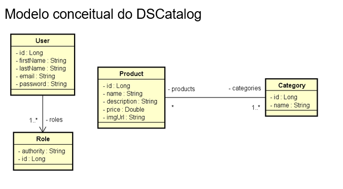

# DS-CATALOG

Projeto realizado a partir do treinamento Java Spring boot da DevSuperior com professor Nélio Alves.

O projeto foi desenvolvido utilizando:

- Java 11
- Spring boot 2.4.4
- JPA / Hibernate
- Spring web
- devtools
- H2

---

### Competências aprendidas:

- Organizar o projeto em camadas
  - Controlador REST
  - Serviço
  - Acesso a dados (Repository)
- Criar entidades
- Configurar perfil de teste do projeto
- Seeding da base de dados
- Criar web services REST
  - Parâmetros de rota @PathVariable
  - Parâmetros de requisição @RequestParam
  - Corpo de requisição @RequestBody
  - Resposta da requisição ResponseEntity<T>
- Padrão DTO
- CRUD completo
- Tratamento de exceções
- Postman (coleções, ambientes)
- Dados de auditoria
- Paginação de dados
- Associações entre entidades (N-N)

---

### Figma do projeto no front-end

https://www.figma.com/file/1n0aifcfatWv9ozp16XCrq/DSCatalog-Bootcamp?type=design&node-id=0-1

### Diagrama UML do projeto

---

A API suporta as requisições de `GET`, `POST`, `PUT`, `DELETE` no seguinte URI:

GET:

- findAll

  - /product - findAll
  - /product - findAll

- Parâmetros passados no GET (Apenas findAll):

  - page
  - linesPerPage
  - direction
  - orderBy

`Busca por id:`

- /products/{id} - findById
- /category/{id} - findById

---

POST:

- products/
- category/{id}

        {
        "name" : "Garden"
        }

---

PUT:

- /products/{id}

        Body:
        {
            "name": "Updated product name",
            "description": "Updated product description",
            "price": 600.0,
            "imgUrl": "",
            "date": "2020-07-20T10:00:00Z",
            "categories": [
                {
                "id": 1
                },
                {
                "id": 3
                }
            ]
        }

- /category/{id}
        Body:
        {
            "name" : "new name"
        }

---

DELETE:

- /products/{id}
- /category/{id}
